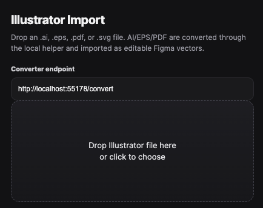

# 🎨 Figma AI Importer

Import `.ai`, `.eps`, `.pdf`, and `.svg` files into Figma.

The plugin uses a small local helper service powered by Inkscape to convert Illustrator/PDF/EPS files to SVG, then imports the result into Figma as editable vector layers.

Figma plugins cannot natively import Adobe Illustrator files.

## 🧠 How it works

```text
.ai / .eps / .pdf
        ↓
 local converter
        ↓
      SVG
        ↓
     Figma
```

## 📸 Screenshot



## ✨ Features

- ⚡ Direct file import inside Figma
- 📂 Supports `.ai`, `.eps`, `.pdf`, `.svg`
- 🛠️ Local conversion helper
- 🔒 No cloud upload
- 🎯 Works best with PDF-compatible Illustrator files

## 📦 Requirements

- Node.js
- Inkscape
- Figma Desktop or Figma in browser
- PDF-compatible Illustrator files recommended

## 🚀 Install

Install dependencies:

    npm install

Start the local converter:

    npm start

The converter runs at:

    http://localhost:55178/convert

### Install Inkscape (macOS)

    brew install --cask inkscape

## 🧩 Figma plugin setup

In Figma:

1. Open Plugins
2. Development
3. Import plugin from manifest
4. Select `manifest.json`

## 🍎 Auto-start on macOS

Copy the LaunchAgent example:

    mkdir -p ~/Library/LaunchAgents
    cp launchagents/tv.gerdon.ai-import-converter.plist.example ~/Library/LaunchAgents/tv.gerdon.ai-import-converter.plist
    launchctl load ~/Library/LaunchAgents/tv.gerdon.ai-import-converter.plist

Check if it runs:

    curl http://localhost:55178/health

## 🔐 Privacy

Files are sent only to the local converter running on your own machine. Nothing is uploaded to a remote server.

## ⚠️ Limitations

Native Illustrator files vary. The best results are with PDF-compatible `.ai` files. Some proprietary or very old Illustrator files may not convert correctly.

## 📄 License

MIT
